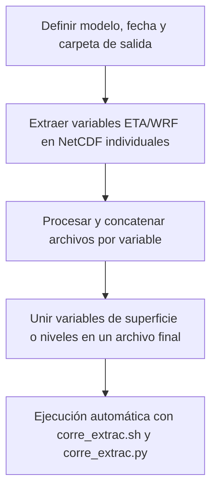
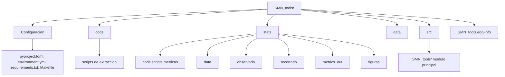

# SMN_tools

**SMN\_tools** es un paquete en Python desarrollado en el SENAMHI para la **extracción, procesamiento, validación y visualización de salidas de modelos meteorológicos** (ETA y WRF).

El paquete transforma archivos **GRIB** en **NetCDF CF-1.8**, reorganizando variables y dimensiones para generar archivos estandarizados listos para análisis. Además, incorpora módulos específicos para:

* **Extracción y concatenación** de variables de superficie y niveles de presión.
* **Evaluación de pronósticos** mediante métricas estadísticas (RMSE, BIAS, correlación, IoA, KGE, etc.).
* **Generación automática de figuras** a partir de archivos NetCDF, tanto de variables como de métricas.
* **Automatización del flujo de trabajo** completo a través de scripts en bash, facilitando la operación en entornos de producción o HPC.

De esta manera, **SMN\_tools** permite integrar en un solo paquete el ciclo completo: desde la lectura de salidas brutas de los modelos hasta la evaluación cuantitativa frente a observaciones y la producción de resultados gráficos.

---




## Dependencias y versiones

Este paquete requiere **Python >= 3.7**.  
Las librerías principales y sus versiones mínimas están definidas en los archivos de configuración:

- `xarray>=2023.7.0`  
- `cfgrib>=0.9.10.4`  
- `numpy>=1.24.3`  
- `netCDF4>=1.6.2`  
- `h5netcdf>=1.2.0`  
- `ipykernel>=6.0.0`  
- `pandas>=2.0.3`
- `eccodes>=2.27.0`
- `h5py>=3.8.0`
- `matplotlib>=3.7.0` (visualización de datos y mapas)
- `pillow>=9.0.0` (soporte de imágenes para matplotlib)

---

## Instalación

Después de clonar el repositorio, tienes **3 métodos** para instalar el paquete:

### **Método 1: Conda (RECOMENDADO para usuarios científicos)**
```bash
git clone https://github.com/Japq91/SMN_tools.git
cd SMN_tools
conda env create -f environment.yml
source activate smn_tools
install-smn-kernel
```
---

## Uso en Jupyter Lab

Después de la instalación, selecciona el kernel en Jupyter Lab:

```
Kernel → Change Kernel → Python (smn_tools) # una  vez dentro de jupyter 
```

Realizando esta modificación se podrá usar las librerías del entorno virtual donde instalaste **SMN_tools**.

---
## Diagrama de la estructura del proyecto


## Estructura del proyecto

```

SMN_tools/
├── environment.yml       # Entorno Conda (conda env create)
├── Makefile              # Instalación rápida con make install
├── cods/                 # Scripts y pruebas de extracción
│   ├── corre_extrac.py   # Para multiples archivos o fechas
│   ├── corre_extrac.sh   # Ejecuta .py
│   ├── test_extrac.py    # No usar
│   └── test_plot.py      # No usar
├── stats/                # Módulo de validación y análisis estadístico
│   ├── cods/             # Scripts de procesamiento
│   │   ├── 01_crea_pisco.py
│   │   ├── 02_extrae_dias.py
│   │   ├── 03_extrae_observado.py
│   │   ├── 04_metrics.py
│   │   └── 05_plot.py
│   ├── data/             # Datos procesados
│   ├── observado/        # Observaciones de referencia
│   ├── recortado/        # Datos recortados por dominio/fecha
│   ├── metrics_out/      # Resultados de métricas estadísticas
│   └── figuras/          # Gráficos de validación
├── data/                 # Datos de entrada brutos
└── src/                  # Código fuente principal
    └── SMN_tools/
        ├── ETA_extrae.py
        ├── WRF_extrae.py
        ├── procesa_netcdf.py
        ├── merge_netcdf.py
        ├── rename_clean.py
        ├── delete_files.py
        ├── scripts/
        │   └── install_kernel.py
        ├── __init__.py
        └── __main__.py

```
---

## Detalle de scripts principales

### 1. Extracción de variables: `ETA_extrae.py` y `WRF_extrae.py`

Los scripts **`ETA_extrae.py`** y **`WRF_extrae.py`** contienen las funciones principales para la **extracción de variables meteorológicas desde archivos GRIB** generados por los modelos **ETA** y **WRF**. 
Ambos convierten las variables en **archivos NetCDF individuales por variable y paso temporal**, facilitando el procesamiento y análisis posterior.

- **Función ETA**: `extrac_ETA(out_path, gribfile, tipo)` 
- **Función WRF**: `extrac_WRF(out_path, gribfile, tipo)` 

#### Variables soportadas

- **Comunes a ambos modelos**
  - Precipitación acumulada (`tp`)
  - Viento en niveles isobáricos (`level_vars`: u, v en 925, 850, 500, 200 hPa)
  - Presión al nivel del mar (`mslp`)
  - Viento a 10 m (`wind10m`: u10, v10 / `10u`, `10v`)
  - Temperatura a 2 m (`t2m`)
  - Humedad relativa a 2 m (`r2m`)

- **Específicas de ETA**
  - Radiación de onda corta descendente (`ssrd`)

- **Específicas de WRF**
  - Temperatura de rocío a 2 m (`d2m`)
  - Geopotencial en niveles (`gh`)

#### Funciones adicionales

- `WRF_extrae.py` incluye la función auxiliar **`make_structured()`**, que reorganiza los datasets en grillas regulares con coordenadas únicas de latitud y longitud, y opcionalmente un eje vertical (`z`), asegurando compatibilidad para análisis posteriores.

### 2. **procesa\_netcdf.py**

* Función: `process_netcdf_files(list_files, prefix_out, new_dims)`
* **Objetivo**:
  * Uniformiza NetCDFs generados en la fase de extracción.
  * Renombra variables y dimensiones.
  * Concatena archivos a lo largo del tiempo.
  * Añade metadatos estándar CF.
* Dimensiones soportadas:
  * Superficie: `["time","lat","lon"]`
  * Niveles: `["time","lev","lat","lon"]`.

### 3. **rename\_clean.py**

* Función: `rename_and_clean(input_file, output_file, var_name_out, dims_out)`
* Renombra dimensiones y variables para uniformizar productos NetCDF.
* Elimina coordenadas innecesarias (`valid_time`, `forecast_reference_time`).
* Configura compresión (`zlib`).
* Retorna un dataset limpio listo para concatenación o fusión.

### 4. **merge\_netcdf.py**

* Función: `merge_files(list_files, output_file, institution="SENAMHI", source=None)`
* Une múltiples archivos NetCDF procesados en un solo producto.
* Añade metadatos globales compatibles con CF-1.8 (`institution`, `source`, `history`, `references`).
* Comprime variables con `zlib`.

### 5. **delete\_files.py**

* Función: `clean_outdir(outdir)`
* Elimina todos los archivos `.nc` de un directorio de salida.
* Útil para limpiar corridas anteriores antes de procesar nuevas.

### 6. **\_\_init\_\_.py**

Expone las funciones principales del paquete:

```python
from .ETA_extrae import extrac_ETA
from .WRF_extrae import extrac_WRF
from .procesa_netcdf import process_netcdf_files
from .rename_clean import rename_and_clean
from .merge_netcdf import merge_files
from .delete_files import clean_outdir
```

---
## Flujo de trabajo – Extracción de variables

El flujo de trabajo completo está ejemplificado en [`cods/test_extrac.py`](cods/test_extrac.py).
Consta de **cinco etapas principales**, que van desde la preparación de la corrida hasta la generación de archivos NetCDF finales de superficie (`sfc`) y niveles (`prs`).

1. **Definir modelo, fecha y carpeta de salida**
2. **Extraer variables ETA/WRF en NetCDF individuales**
3. **Procesar y concatenar archivos por variable**
4. **Unir variables de superficie o niveles en un archivo final**
5. **Ejecución automática con `corre_extrac.sh` y `corre_extrac.py`**

---

#### 1. Definir modelo, fecha y carpeta de salida

Se configura el modelo a usar (`PERU_ETA22` o `PERU_WRF22`), así como fecha y hora de la corrida.
Además, se prepara la carpeta de salida y se limpian archivos `.nc` de corridas anteriores:

```python
model = "PERU_ETA22"   # o "PERU_WRF22"
hor, dia, mes, yea = "06", "01", "01", "2025"
outdir = f"/ruta/out/{model}"
os.system(f'mkdir -p {outdir}')
clean_outdir(outdir)   # elimina archivos previos
```

---

#### 2. Extraer variables ETA/WRF en NetCDF individuales

Dependiendo del modelo, se seleccionan archivos GRIB y se extraen las variables solicitadas.
Ejemplo para ETA:

```python
tipos = ['tp','level_vars','wind10m','t2m','r2m','ssrd','mslp']
for file_p in files_prono:
    if "ETA" in model: extrac_ETA(outdir, file_p, tipos)
    if "WRF" in model: extrac_WRF(outdir, file_p, tipos)
```

Cada variable se guarda como un archivo NetCDF independiente en la carpeta de salida, con su respectivo timestamp.

---

#### 3. Procesar y concatenar archivos por variable

Una vez extraídas, las variables deben estandarizarse en dimensiones y concatenarse en el tiempo.

* Para **superficie** (`sfc`): se usan dimensiones `["time","lat","lon"]`.
* Para **niveles de presión** (`prs`): se usan dimensiones `["time","lev","lat","lon"]`.

```python
for var_in in ['prs','sfc']:
    if var_in == 'prs':
        nueva_lista = ['u','v']   # variables en niveles
        new_dims0 = ["time","lev","lat","lon"]
    else:
        nueva_lista = ['tp','10u','10v','t2m','r2m','mslp','ssrd']
        new_dims0 = ["time","lat","lon"]
    for var in nueva_lista:
        files_vars = gb(f'{outdir}/{var}_*')
        process_netcdf_files(files_vars, prefix_out=var_in, new_dims=new_dims0)
```

Esto produce archivos intermedios con prefijo `sfc_tmp_` o `prs_tmp_`.

---

#### 4. Unir variables de superficie o niveles en un archivo final

Finalmente, todas las variables de superficie (`sfc`) o niveles (`prs`) se combinan en un único NetCDF comprimido con metadatos CF-1.8:

```python
for var_in in ['prs','sfc']:
    files_variables = gb(f"{outdir}/{var_in}_*")
    if len(files_variables) == 0: continue
    final_name = f"{model}_{yea}{mes}{dia}{hor}_{var_in}.nc"
    out_file = os.path.join(run_dir, final_name)
    merge_files(files_variables, out_file)
```

**Salida final (ejemplo ETA):**

```
PERU_ETA22_2025010106_sfc.nc
PERU_ETA22_2025010106_prs.nc
```

**Salida final (ejemplo WRF):**

```
PERU_WRF22_2025010106_sfc.nc
PERU_WRF22_2025010106_prs.nc
```

---

#### 5. Ejecución automática con `corre_extrac.sh` y `corre_extrac.py`

Además del ejemplo en Python, la extracción puede ejecutarse directamente mediante los scripts `corre_extrac.sh` y `corre_extrac.py`.

* **`corre_extrac.sh`**
  Script en bash que define las rutas de entrada (GRIB), el modelo, la fecha, la hora y la carpeta de salida. Llama internamente a `corre_extrac.py` y permite correr el flujo en entornos HPC o servidores.

* **`corre_extrac.py`**
  Implementa en Python el flujo completo:

  1. Selección de archivos GRIB del modelo (ETA o WRF).
  2. Extracción de variables (`tp`, `t2m`, `r2m`, `ssrd`, `prmsl`, `u10`, `v10`, `u`, `v`, …).
  3. Estandarización de dimensiones y concatenación en el tiempo.
  4. Combinación final en archivos NetCDF CF-1.8 comprimidos.

Ejemplo de uso en bash:

```bash
bash corre_extrac.sh /scratch/Datatemporal/SMN/data/regional PERU_ETA22 20250101 06 /scratch/SMN_tools/out
```

**Salida automática:**

```
/scratch/SMN_tools/out/PERU_ETA22/06Z/PERU_ETA22_2025010106_sfc.nc
/scratch/SMN_tools/out/PERU_ETA22/06Z/PERU_ETA22_2025010106_prs.nc
```
---
## Scripts en `stats/cods/`

El directorio `stats/cods/` contiene los componentes principales para la generación de climatologías observadas, la extracción de pronósticos diarios y la evaluación mediante métricas estadísticas. Estos scripts están diseñados para trabajar de manera encadenada, desde la preparación de datos observados hasta la obtención de resultados gráficos listos para el análisis.

En primer lugar, el script `01_crea_pisco.py` construye la climatología observada de referencia a partir de los datos de temperatura máxima y mínima de PISCO. Con ello se obtiene la temperatura media diaria, se recorta el período base (1981–2010) y se genera una climatología promedio por día del año, almacenada como archivo NetCDF comprimido.

A continuación, `02_extrae_dias.py` permite extraer del pronóstico las series diarias para un rango de fechas y para un día específico de la corrida (D1, D2, …). Este script ajusta automáticamente la escala temporal de UTC a hora local (GMT-5) y aplica distintos métodos de agregación según la variable: acumulados de 07:00 a 07:00 en el caso de precipitación (siguiendo la normativa OMM) y promedios diarios para el resto de variables. El resultado es un NetCDF con la serie diaria de pronóstico filtrada en el rango temporal solicitado.

El siguiente paso se realiza con `03_extrae_observado.py`, toma el dato observado y la interpola a la malla del modelo de pronóstico. Posteriormente, selecciona las fechas del pronóstico, creando así un archivo NetCDF alineado tanto en tiempo como en espacio con los datos del modelo.

Con los datos ya comparables, `04_metrics.py` se encarga de calcular las métricas estadísticas que evalúan el desempeño del pronóstico frente a la observación. Entre las métricas implementadas se encuentran el error cuadrático medio (RMSE), el sesgo (BIAS), la correlación de Pearson, el índice de acuerdo (IoA), la eficiencia Kling-Gupta (KGE) y la exactitud dentro de un rango de ±1σ. Todos estos resultados se almacenan en un NetCDF que consolida las estadísticas para cada variable.

Finalmente, `05_plot.py` automatiza la generación de figuras a partir de cualquier archivo NetCDF, incluyendo las salidas de métricas. Este script recorre cada variable (excluyendo las coordenadas), produce un mapa con `matplotlib` y `xarray`, y exporta cada gráfico en formato PNG dentro de la carpeta de salida definida por el usuario.

---

## Flujo de trabajo – Cálculo de métricas

El cálculo de métricas se realiza después de generar los archivos NetCDF de superficie (`sfc`) y niveles (`prs`).
Este flujo toma como entrada los pronósticos extraídos y los datos observados (PISCO observado) y produce como salida archivos NetCDF con estadísticas y figuras en formato PNG.

Consta de **cuatro etapas principales**:

1. **Generar climatología/observado como referencia**
2. **Extraer días de pronóstico y observado asociada**
3. **Calcular métricas estadísticas**
4. **Generar figuras a partir de las métricas**

---

#### 1. Generar climatología observada de referencia, caso no tener "observado" para esas fechas

Se utiliza el script [`01_crea_pisco.py`](stats/cods/01_crea_pisco.py) para generar la climatología base de PISCO (1981–2010).
El resultado es un NetCDF con la variable `t2m` como climatología diaria, situacion provisional hasta cambiar el archivo por datos observados.

```bash
python 01_crea_pisco.py
```

**Salida:**

```
observado/clima_pisco_t2m.nc
```

---

#### 2. Extraer días de pronóstico y climatología asociada

Primero se extraen días específicos (D1, D2, …) del pronóstico con [`02_extrae_dias.py`](stats/cods/02_extrae_dias.py):

```bash
python 02_extrae_dias.py <input_dir> <modelo> <fecha_ini:YYYYMM> <fecha_fin:YYYYMM> <var_name> <day>
```

Ejemplo para temperatura a 2 metros para el tercer dia de prevision del modelo ETA22:

```bash
python 02_extrae_dias.py ./out PERU_ETA22 20250210 20250310 t2m 3
```

Esto genera un archivo en `data/`:

```
data/PERU_ETA22_D3_20250210_20250310_t2m.nc
```

Luego se ajusta el dato observado a las fechas del pronóstico con [`03_extrae_observado.py`](stats/cods/03_extrae_observado.py):

```bash
python 03_extrae_observado.py clima_pisco_t2m.nc pronostico.nc observado_recortado.nc
```

**Salida:**

```
observado/observado_recortado.nc
```

---

#### 3. Calcular métricas estadísticas

Se utilizan las funciones de [`04_metrics.py`](stats/cods/04_metrics.py) para evaluar el pronóstico contra lo observado/climatología.

```bash
python 04_metrics.py pronostico.nc observado_recortado.nc t2m metrics/PERU_ETA22_D3_20250210_20250310_t2m_metrics.nc
```

**Métricas calculadas:**

* RMSE
* BIAS
* Correlación de Pearson (`Pearson_r`)
* Índice de acuerdo (`IoA`)
* KGE
* Accuracy dentro de 1 sigma (`Accuracy_sigma`)

**Salida:**

```
metrics_out/PERU_ETA22_D3_202502_202503_t2m.nc
```

---

#### 4. Generar figuras a partir de las métricas

Finalmente, se visualizan las métricas en mapas usando [`05_plot.py`](stats/cods/05_plot.py):

```bash
python 05_plot.py metrics_out/PERU_ETA22_D3_20250210_20250310_t2m.nc figuras/
```

**Salida (ejemplos):**

```
figuras/RMSE_PERU_ETA22_D3_20250210_20250310_t2m.png
figuras/BIAS_PERU_ETA22_D3_20250210_20250310_t2m.png
figuras/Pearson_r_PERU_ETA22_D3_20250210_20250310_t2m.png
```
#### 5. Ejecución automática con `run1_extrae.sh`

Todos los pasos anteriores pueden ejecutarse de forma secuencial utilizando el script en bash [`run1_extrae.sh`](stats/cods/run1_extrae.sh).
Este script recibe como parámetros las fechas, la variable, el modelo y las rutas de salida, y coordina la ejecución de:

1. `02_extrae_dias.py` – extracción del día de pronóstico
2. `03_extrae_observado.py` – recorte de observado a las fechas del pronóstico
3. `04_metrics.py` – cálculo de métricas estadísticas
4. `05_plot.py` – generación de figuras

Ejemplo de uso para extraer el día 3 de previsión del modelo ETA22, entre el 10 de febrero y el 10 de marzo de 2025, evaluando la variable `t2m`:

```bash
bash run1_extrae.sh PERU_ETA22 20250210 20250310 t2m 3
```

**Salida generada automáticamente:**

* NetCDF diarios del modelo en `data/`
* Observado recortado en `recortado/`
* Métricas en `metrics_out/`
* Figuras en `figuras/`

---

### Salida final del flujo de métricas

1. Climatología base:

   * `observado/clima_pisco_t2m.nc`

2. Archivos diarios de pronóstico y climatología/observado:

   * `data/PERU_ETA22_D3_20250210_20250310_t2m.nc`
   * `recortado/PERU_ETA22_D3_20250210_20250310_t2m.nc` # dato observado cortado

3. Métricas en NetCDF:

   * `metrics_out/PERU_ETA22_20250210_20250310_t2m_metrics.nc`

4. Figuras en PNG:

   * `figuras/<Métrica>_<archivo>.png`

## Licencia

MIT License.
